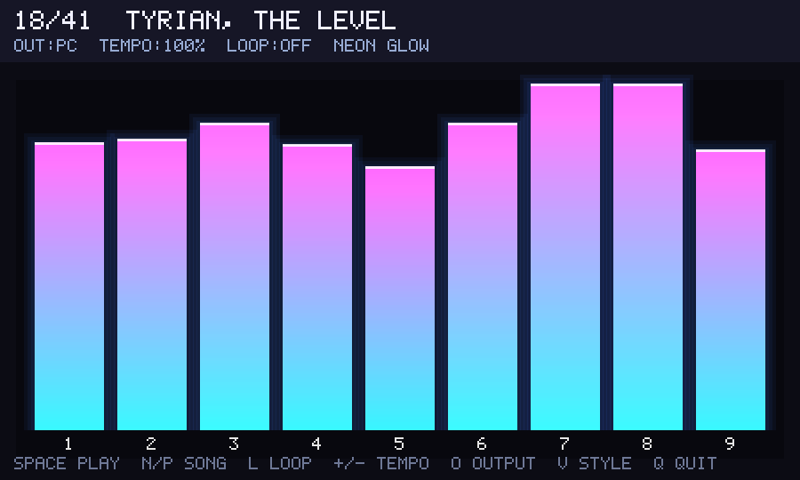
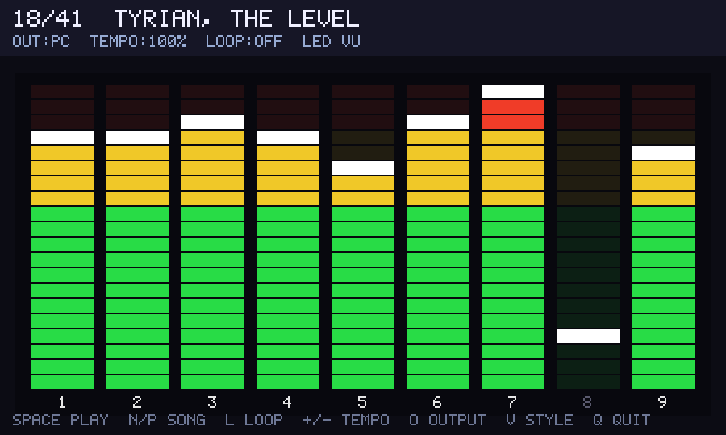
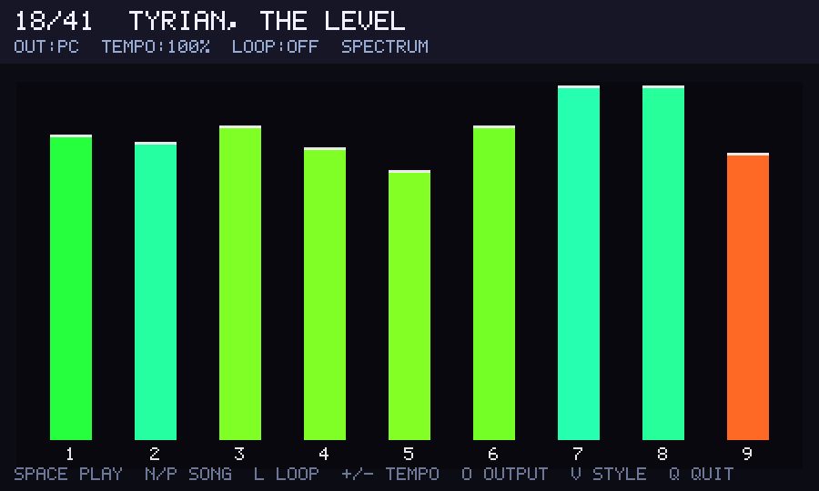

# tyrian-retrowave

Play [Tyrian](https://en.wikipedia.org/wiki/Tyrian_(video_game))'s music on a
real Yamaha **YMF262 (OPL3)** via a
[RetroWave OPL3 Express](https://github.com/SudoMaker/RetroWave) board over
USB-serial (default `/dev/ttyACM0`, 2,000,000 baud) — or on your PC's speakers
via a software OPL3 emulator.

Both players run Tyrian's **actual** LDS music driver (`src/lds_play.c`, from
OpenTyrian) and forward the OPL register writes it produces. Output is
reference-grade: exact instruments, timing, and loop points.



There are two programs:

| | `tyrian_rwgui` | `tyrian_rwplay` |
|---|---|---|
| Interface | graphical app + channel visualizer | terminal |
| Audio | PC (emulated) and/or the board | board only |
| Dependencies | SDL2 | none (just a C compiler) |

## Build

```sh
make            # builds both; needs SDL2 for the GUI
```

`make tyrian_rwplay` builds only the dependency-free CLI player.

## GUI player

```sh
./tyrian_rwgui -d ttyACM0 /path/to/MUSIC.MUS
```

A window opens with a synth-style **channel-activity visualizer** — one bar per
OPL channel, driven directly by the register stream (key-on, note pitch, and
carrier level). Three switchable styles:

| LED VU | Neon glow | Spectrum |
|---|---|---|
|  |  |  |

Output is selectable at runtime: **PC**, **Board**, or **Both**. If the board
isn't connected it falls back to PC audio, so the app works on any machine.

Options: `-d DEV` (serial device, `-` = no board), `-s N` (start song), `-l`
(loop).

Keys:

| key | action | key | action |
|---|---|---|---|
| `space` | play / pause | `o` | cycle output (PC / Board / Both) |
| `n` / `→` | next song | `v` | cycle visualizer style |
| `p` / `←` | previous song | `+` / `-` | tempo |
| `r` | restart | `l` | toggle loop |
| `q` / `Esc` | quit | | |

## CLI player

A dependency-free terminal player that streams to the board:

```sh
./tyrian_rwplay -d ttyACM0 /path/to/MUSIC.MUS
```

Options: `-d DEV` (`-` = dry run), `-s N`, `-l`, `-h`. Transport keys:
`n`/space next, `p` prev, `r` restart, `l` loop, `+`/`-` tempo, `q` quit.

---

`MUSIC.MUS` is your own file from a legitimate copy of Tyrian. It is **not**
redistributable and is not included here.

## How it works

- `src/lds_play.c` — Tyrian's LDS driver, vendored unmodified from OpenTyrian.
- `src/retrowave_serial.c` — RetroWave 7-of-8 wire framing + OPL register-write
  / reset packets. 2 Mbaud is mandatory; a wrong baud rate fails silently.
- `src/tyrian_rwplay.c` — CLI: loads the `MUSIC.MUS` bank, drives the driver at
  69.5 Hz against monotonic deadlines (the OPL chip has no timing of its own),
  and shims `adlib_*` / `fread_die`.
- `src/rwgui.c` — GUI: an SDL2 app whose audio callback clocks the driver from
  the sample counter (as the original game does), fans the register stream out
  to the emulator (PC), the board, and the visualizer, and renders the bars.
- `src/emu/opl.c` — DOSBox software OPL2/OPL3 emulator (GUI/PC audio only).
- `src/compat/` — tiny stand-ins for the OpenTyrian headers `lds_play.c`
  includes, so the CLI needs no SDL.

`lds_play.c` is compiled separately per target because the two builds route the
`opl_write` macro differently (CLI → emulator stub; GUI → a fan-out hook). To
re-vendor after an upstream change, copy `src/lds_play.{c,h}` (and, for the
emulator, `src/emu/opl.{c,h}`) from OpenTyrian2000 again.

## License

See [LICENSE.md](LICENSE.md). In short: `lds_play.{c,h}` is GPL-2.0-or-later and
`emu/opl.c` is LGPL-2.1-or-later (both from OpenTyrian/DOSBox); the RetroWave
framing is from SudoMaker (AGPL-3.0); the combined work is distributed under the
GNU GPL v3 (or later).
